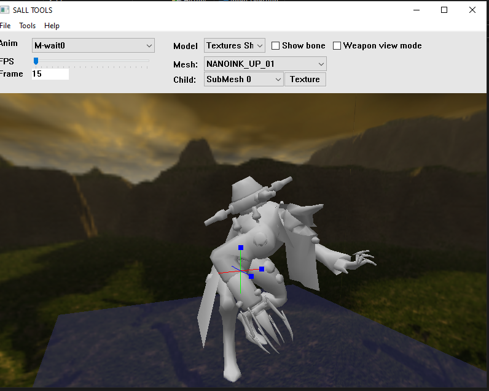

# NEW SALL TOOL
View model 3d LTB file.
## 
Cấu trúc lại code cho dễ đọc, tối ưu hóa thuật toán tính toán ma trận.
## Screenshot

## Build.
 Để buil được salltool cần, sử dụng visual studio 2010 or later, cài thêm freeglut.

## Thành phần

### Main.cpp
```c
	LtbLoader loader("Model_5.LTB");
	printf("Ltb version: %d\n", loader.m_version);
 
	printf("========= [Bone %d] =========\n", loader.m_nBone);
	for (int i = 0; i < loader.m_nBone; i++) {
		printf("m_Bone: %s %d\n", loader.m_Bone[i].name,loader.m_Bone[i].par);
	}
	
	printf("========= [Anim %d] =========\n", loader.m_nAnim);
	for (int i = 0; i < loader.m_nAnim; i++) {
		printf("m_Anim: %s\n", loader.m_Anim[i].name);
	}

	printf("========= [Mesh %d] =========\n", loader.m_nMesh);
	for (int i = 0; i < loader.m_nMesh; i++) {
		printf("m_Mesh: %s\n", loader.m_Mesh[i].name);
	}
	
```
Chạy ở chế độ console. phục vụ test.
### GLWindow.cpp
Chứ các hàm khởi tạo màn hình OpenGL
### GLfunction.cpp
Chứa các hàm thao tác với cửa sổ OpenGL
như : draw mesh, draw bone ...
đổi skyp box tại hàm load_sky_box
```c

	LoadTgaImage("SkyBox/de_stormft.tga", SkyBoxIndex[0], &Sizex, &Sizey);
	LoadTgaImage("SkyBox/de_stormrt.tga", SkyBoxIndex[2], &Sizex, &Sizey);
	LoadTgaImage("SkyBox/de_stormlf.tga", SkyBoxIndex[3], &Sizex, &Sizey);
	LoadTgaImage("SkyBox/de_stormbk.tga", SkyBoxIndex[1], &Sizex, &Sizey);
	LoadTgaImage("SkyBox/de_stormup.tga", SkyBoxIndex[4], &Sizex, &Sizey);
	LoadTgaImage("SkyBox/de_stormdn.tga", SkyBoxIndex[5], &Sizex, &Sizey);

```
### Model.cpp
Thư viện xử lý mô hình 3D. xử dụng các công thức tính toán ma trận tính toán lại tọa độ bone, tọa animation ...
các hàm cần chú ý:
```c
	void prepareMesh();
	void drawBone();
	void drawMesh(int type);
	void drawGetAnim();
	void boneTransform(ltb_frame* frame);
```
### LtbLoader.cpp
Thư viện load file LTB (thành quả 3 năm ripmod cf)
### GnMath.cpp 
Thư viện tính toán ma trận.
```c
float DotProduct(vec3_t x, vec3_t y);
bool InverseMat(matt4x4_t m, matt4x4_t& invOut);
void VectorTransform(vec3_t in1, matt4x4_t in2, vec3_t& out);
void VectorRotate(vec3_t in1, matt4x4_t in2, vec3_t& out);
void QuaternionMatrix(vec4_t quaternion, matt4x4_t& matrix);
void PostionSlerp(vec3_t p, vec3_t  p2, float t, vec3_t& presual);
void QuaternionSlerp(vec4_t p, vec4_t q, float t, vec4_t& qt);
void ConcatTransforms(matt4x4_t in1, matt4x4_t in2, matt4x4_t& out);
```
### Textures.cpp 
Thư viện xử lý ảnh DTX,TGA ...
```c
int GenerateTexturesID(void);
int LoadDTXImage(const char* szFileName, int Index, int* pWidth, int* pHeight);
int LoadTgaImage(const char* szFileName, int Index, int* SizeW, int* SizeH);
``
